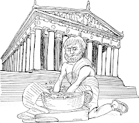
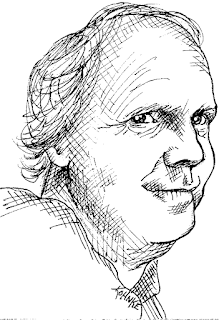
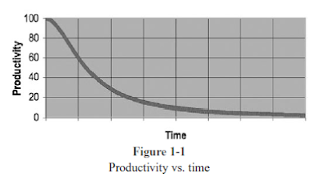
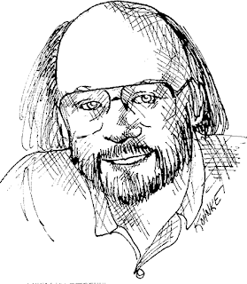
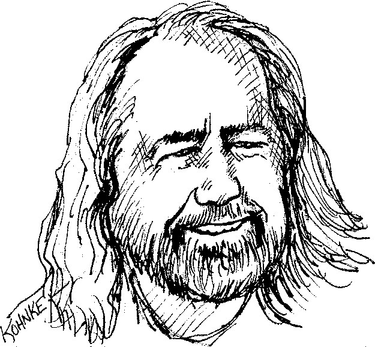
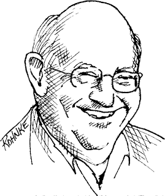
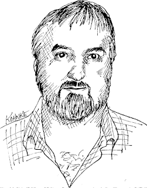

# clean-code-vietnamese
-----------------------------------------------------------------------------  
## Chapter 1: Clean Code

Trước hết, bạn đọc cuốn sách này bởi hai lý do:
- Đầu tiên, bạn là một lập trình viên.
- Thứ hai, bạn muốn trở thành một lập trình viên tốt.

### There Will Be Code

Người ta có thể cho rằng bằng cách nào đó về sau viết code sẽ không còn là vấn đề nữa; rằng chúng ta chỉ cần quan tâm đến các Mô hình và các Yêu cầu là đủ. Thực tế một số người cho rằng thời đại của chúng ta đang tiến gần tới sự kết thúc của việc viết Code. Lập trình viên sẽ không cần thiết nữa bởi vì những khách hàng kinh doanh sẽ tự tạo ra các chương trình bằng cách nhập các thông số kỹ thuật.  
  
 
Điều đó là phi lý! Chúng ta sẽ không bao giờ thoát ra khỏi các đoạn code, bởi vì code đại diện cho chi tiết của các yêu cầu. Chi tiết ở một vài mức độ không thể bỏ qua hay trừng tượng hóa được mà phải được đặc tả rõ ràng. Và đặc tả chi tiết các yêu cầu như vậy để máy tính có thể thực hiện được chúng thì chính là việc lập trình, cụ thể ở đây là việc viết code.  

  Vẫn hy vọng rằng mức độ trừu tượng của các ngôn ngữ lập trình sẽ tiếp tục tăng, có thêm nhiều ngôn ngữ miền cụ thể hơn nữa. Đó là điều tốt, Tuy nhiên nó không thể loại bỏ việc viết code. Dù có các công cụ hỗ trợ nhưng nó vẫn phải được thực hiện một cách nghiêm túc, chính xác để máy tính có thể hiểu được và thực hiện đúng các chi tiết.
 

  Nhiều người nghĩ rằng code một ngày nào đó sẽ biến mất, máy tính có thể hiểu được những yêu cầu mơ hồ và thực hiện chính xác một cách hoàn hảo đáp ứng những nhu cầu đó. Họ vẫn mơ rằng sẽ có một ngày chúng ta sẽ tạo ra được một cỗ máy có thể làm được những gì chúng ta muốn thay vì những gì chúng ta nói.
 

  Điều đó là phi thực tế!
 

  Hãy nhớ rằng code thực sự là ngôn ngữ cuối cùng mà chúng ta thể hiện các yêu cầu. Chúng ta có thể tạo ra các ngôn ngữ gần với yêu cầu, tạo ra các công cụ giúp chúng ta phân tích và tập hợp những yêu cầu thành cấu trúc chính thúc.
 

  Nhưng chúng ta sẽ không bao giờ loại bỏ code - `so there will always be code`!
 
 
#### Tóm lại 
Cả đoạn kết lại 1 câu là Code, Code nữa, Code mãi... Dù công nghệ có tiên tiến đến đâu thì đối với lập trình viên code không thể thay thế và việc viết code gắn liền với lập trình viên for a long time đến khi bỏ nghề :D  

### Bad Code
Tác giả nói về việc đọc lời tựa trong cuốn sách Implementation Patterns của Kent Beck: "... Sách được viết dựa theo một giả thiết khá mong manh: Đó là vấn đề về good code" và phủ định nó, cho rằng good code là tiền đề trong những cơ sở quan trọng nhất của lĩnh vực lập trình. Đội ngũ của tác giả đã phải đối phó với vấn đề thiếu thốn good code quá lâu rồi.
 
  

Tiếp theo là một ví dụ về một ứng dụng (killer), nó rất phổ biến, được rất nhiều chuyên gia mua và sử dụng. Một chương trình hot như Ngọc Trinh nhưng cũng "não ngắn" như Ngọc Trinh,  thành ra chương trình càng ngày càng sa sút sau mỗi đợt phát hành, đợt sau tàn tạ hơn đợt trước đến nỗi tác giả phải shut down và say goobye. Và bầu sô của Ngọc Trinh cũng sập tiệm một thời gian sau đó.  

Hai thập kỷ sau, Robert C.Martin gặp lại ekip lăng xê của Ngọc Trinh và có hỏi tại sao em nó tàn tạ đến như vậy. Câu trả lời khẳng định lại nỗi lo sợ của tác giả ở trên. Họ vội vã lăng xê sản phẩm ra thị trường và thực hiện trong nó một đống lộn xộn các code. Sau mỗi lần update mông má thêm thì như ị thêm shit vào bãi rác, và bãi rác thành một bãi bự hơn. Khi đó thì công nhân môi trường không thể dọn dẹp được nữa. Bãi rác đó kéo công ty đi xuống.
 

Đã bao giờ bạn đâm đầu vào mã bẩn? Chắc chắn nếu bạn là một lập trình viên có kinh nghiệm, bạn đã rất nhiều lần cụng đầu vào nó. Chính xác hơn là lội qua mã bẩn. Bơi qua một bãi lầy đầy bụi gai và cạm bẫy ẩn hiện, tự tìm đường đi và hi vọng có một ít gợi ý, một số manh mối, về chuyện quái gì đang xảy ra, bơi trong đầm lầy nhưng không thấy đâu là bờ cuối cùng đành chấp nhận chết chìm trong nó.
 

Tất nhiên là bạn chết chìm trong nó - Vậy thì, cuối cùng tại sao lại xuất hiện cái đầm lầy đó?
 

Có thể bạn cố gắng làm nhanh? Vội vàng? Không có thời gian để làm tốt hơn vì Deadline, sếp thúc đít, rằng sếp sẽ tức giận nếu bỏ thời gian làm sạch mà không làm cho xong. Có thể mệt mỏi muốn làm cho xong phứt đi rồi over. Thế nên dù Code của bạn có tởm lợm như nào nhưng chạy không có lỗi gì cũng xem như xong rồi. Tự nhủ rằng sẽ quay lại và dọn dẹp nó sau nhưng chúng ta không biết một điều, luật của LeBlanc: `Later equals never (Để sau có nghĩa là không bao giờ)`.
 

### The Total Cost of Owning a Mess
Code bẩn (Messy Code) sẽ làm cho công việc chậm lại một cách đáng kể. Lúc đầu, team thực hiện rất nhanh khi bắt đầu dự án. Mỗi lần thay đổi, lại phá vỡ vài phần khác của Code. Mỗi lần thêm hoặc sửa, hệ thống lại rối rắm, xoắn quẩy,... Qua thời gian thì sự lộn xộn đó lớn dần lên. Và không có cách nào dọn sạch nó.
 

Năng suất theo đó giảm dần và tiệm cận về 0 `(Năng suất giảm -> Management thêm nhân viên -> Nhân viên mới không hiểu hệ thống -> Làm và làm -> Áp lực -> Tiêu diêu về miền cực lạc (R.I.P)...)`.
 
  
#### 
 The Grand Redesign in the Sky (Cuộc tái thiết vĩ đại giữ lưng chừng trời) 
 

Chuyện về việc trong 10 năm, quản lý thực hiện việc phát triển song song dự án cũ và dự án mới thay thế cho dự án cũ vì Code bẩn.
 

Cuối cùng họ không chịu nổi nữa và thông báo với quản lý rằng họ không thể tiếp tục mớ mã nguồn hỗn loạn này nữa. Họ yêu cầu được thiết kế lại. Quản lý không muốn phải dùng cạn chi phi cho việc thiết kết lại dự án, nhưng không thể phủ nhận rằng, năng suất hiện đang rất là khủng khiếp. Cuối cùng họ cũng nhượng bộ đội ngũ phát triển và đồng ý  bắt đầu cuộc tái thiết vĩ đại.
 

Một team hổ mới được lựa chọn. Mọi người đều muốn vào team này bởi vì nó là một dự án mới toanh. Họ sẽ được bắt đầu lại từ đầu và làm một thứ gì đó thật tốt đẹp. Nhưng chỉ những người giỏi nhất và có triển vọng nhất được lựa chọn. Những người còn lại vẫn phải tiếp tục bảo trì hệ thống hiện tại.
 

Bây giờ thì cả hai team đều đang ở trong một cuộc đua. Team hổ phải xây dựng hệ thống mới làm được những gì mà hệ thống cũ đang làm. Không chỉ vậy, họ phải theo kịp những gì thay đổi đang tiếp tục diến ra ở trên hệ thống cũ. Quản lý sẽ không thay đổi hệ thống cũ cho đến khi hệ thống mới có thể làm được tất cả mọi thứ mà hệ thống cũ làm.
 

Cuộc đua này đã diễn ra trong một thời gian rất dài. Nó đã mất đến 10 năm. Theo thời gian, những thành viên thuộc team hổ đã rời đi, và những thành viên hiện tại đang tiếp tục yêu cầu tái thiết kế lại hệ thống mới vì hệ thống mới đã lại là một mỡ hỗn độn.
 

Chuyện giữ mã sạch không chỉ là chi phi mà nó còn là vấn đề sống còn của lập trình viên.
 
#### - Attitude (Thái độ)
Bạn đã bao giờ lội qua một mớ hỗn độn trong vài tuần trong khi chỉ cần thực hiện nó trong vài giờ? Những gì bạn thấy là thay đổi một dòng thay vì thực hiện ở hàng trăm module khác nhau?
 

Vậy thì điều gì xảy đến với Code? Tại sao Good Code nhanh chóng bị mục nát trở thành Bad Code? Có rất nhiều lý do, nhưng yêu cầu thay đổi ngăn cản thiết kế ban đầu, lịch làm việc quá chặt chẽ, stupid manager và khách hàng không khoan nhượng,... Nhưng lỗi ở trong chính chúng ta.
 

Nếu là một lập trình viên không chuyên nghiệp, bạn sẽ đổ lỗi cho những yêu cầu thay đổi bất thình lìn của khách hàng, deadline của manager cứ thúc vào đít,..
 

Nói vậy thì chả khác nào ông bác sĩ không rửa tay làm bệnh nhân nhiễm khuẩn mà chết rồi ra trước tòa cãi lại rằng: thằng cha bệnh nhân yêu cầu tui mổ luôn cho nhanh, không cần phải rửa tay, tui có ghi âm lại đàng hoàng nè.
 

Vậy nên nghĩa vụ của một lập trình viên chuyên nghiệp là bảo vệ Code của mình (mặc dù chậm Deadline nhưng vẫn phải sạch) trước ông manager. Vì ông manager cũng như tay bệnh nhân kia, chả biết quái gì về Code sạch (và cái giá phải trả cho hàng loạt Code bẩn).
 

#### - The Primal Conundrum (Bài toán căn bản)
Muốn đúng hạn phải viết Code sạch. Bởi vì Code lộn xộn sẽ làm bạn chậm lại ngay lập tức. Cách duy nhất để đáp ứng tiến độ, cách duy nhất để đi nhanh đó là giữ cho mã nguồn của bạn luôn sạch nhất có thể. 
 

#### - The Art of Clean Code? (Nghệ thuật của mã sạch)
Làm thế nào để viết Code sạch?
 
Viết Code sạch là một nghệ thuật, đơn giản bạn có thể nhìn vào và nhận biết đâu là Code sạch, đâu là Code bẩn, nhưng không có nghĩa là chúng ta biết làm thế nào để viết Code sạch (Viết code sạch tương tự như chúng ta vẽ một bức tranh, phần lớn chúng ta đều có thể nhận ra được tranh được vẽ đẹp hay xấu, nhưng nhân thức được cái đẹp không có nghĩa là chúng ta biết làm thế nào để vẽ).
 

Để viết mã sạch bạn phải có code-sense của cleanliness (cảm giác mã về sự sạch sẽ), có thể luyện tập được thông qua quá trình áp dụng hàng nghìn kỹ thuật nhỏ vào việc viết code. Khi có được sẽ nhận biết được đâu là Code sạch đâu là Code bẩn, và có thể biến Code bẩn thành Code sạch, có được cảm giác và lựa chọn thay đổi tốt nhất.
 

Lập trình viên viết Code sạch là một nghệ sĩ có thể vẽ lên một màn hình trống rỗng thành một hệ thống mã thanh lịch.
 

#### - What Is Clean Code?
<strong>Bjarne Stroustrup </strong>(Cha đẻ C++): "<i>Tôi thích code của tôi thanh lịch (đẹp, tinh tế và đơn giản) và hiệu quả. Lô-gic nên đơn giản để làm cho nó khó gặp những lỗi ẩn, có tối thiểu những sự phụ thuộc để dễ dàng bảo trì, xử lý lỗi hoàn chỉnh theo những chiến lược thống nhất, và hiệu suất gần như tối ưu để không cám dỗ người ta làm mã lộn xộn với những trò tối ưu hóa lố lăng. Code sạch là code làm tốt một thứ.</i>" 

 
<strong>Grady Booch </strong> (Object Oriented Analysis and Design with Applications ): "<i>Đơn giản và trực tiếp. Code sạch được đọc như đọc văn xuôi được viết trôi chảy. Không làm lu mờ đi mục đích thiết kế, nhưng vẫn đầy đủ các khái niệm trừu tượng hóa rõ ràng (nhanh nhạy quyết đoán và cần thiết) và những dòng mã điều khiển đơn giản dễ hiểu.</i>"
 

 
<strong>"Big" Dave Thomas </strong>(Sáng lập OTI, Bố già của Eclipse): "<i>Có thể được đọc và cải tiến bởi một developer khác chứ không nhất thiết phải là tác giả bản đầu. Có Unit Test trên phương diện lập trình viên và Acceptance Test trên phương diện khách hàng. Có Meaningfull Names. Chỉ đưa ra một cách để làm một thứ chứ không phải nhiều cách để giải quyết vấn đề đó. Tối giản sự phụ thuộc, và luôn được định nghĩa một cách rõ ràng, tối thiểu hóa các API. Code nên dễ đọc, bởi vì tùy từng ngôn ngữ không phải tất cả các thông tin cần thiết đều được thể hiện rõ ràng trong một mình Code.</i>"
 

 
<strong>Michael Feathers </strong>(Working Effectively with Legacy Code): "<i>Written by someone who cares, bạn có thể làm nó tốt hơn.</i>" => Mã sạch là mã được viết ra bởi một người có tâm.
 

 
<strong>Ron Jeffries </strong>(Extreme Programming Installed và Extreme Programming Adventures in C#):  
 <i>Quy tắc của Beck về mã nguồn xếp theo mức độ ưu tiên:
- Chạy hết các test.
- Không có sự trùng lặp.
- Thể hiện các ý tưởng thiết kế vào trong hệ thống.
- Giảm số lượng các thực thể như class, method, function,... 
</i> 
Tính rõ nghĩa: Không chỉ là meaningful name, nó còn nằm ở do one thing.  
=> Giảm thiểu sự trùng lặp, do one thing, rõ nghĩa và xây dựng những mô hình trừu tượng hóa nhỏ.
 

 
<strong>Ward Cunningham </strong>(Wiki, Fit, eXtreme Programming,): "<i>Bạn có biết bạn vẫn đang làm trên code sạch khi mỗi đoạn code mà bạn đọc đúng như những gì bạn mong đợi. Bạn có thể gọi nó là mã đẹp khi mã đó làm cho ngôn ngữ trông như là ngôn ngữ được tạo ra để giải quyết chính vấn đề đó.</i>"
 

=> Bạn đọc mã mà không có bất cứ sự ngạc nhiên nào. Bạn không cần phải tốn nhiều công sức để đọc mã sạch. Bạn đọc nó và nó đúng với những gì bạn mong đợi. Nó rõ ràng, đơn giản và thuyết phục. Module này nối tiếp module khác, nó sẽ cho bạn biết những gì sẽ được viết tiếp theo. 
=> Mã đẹp: Không phải ngôn ngữ được sinh ra để thiết kế giải quyết vấn đề của chúng ta. Vấn đề làm cho ngôn ngữ trông thật đơn giản để cứ như được sinh ra để giải quyết vấn đề này vậy. Và trách nhiệm đó là của chúng ta.
 

 

### Schools of Thoughts (Các trường phái)

Trong võ đạo thì mỗi người sáng lập là có một trường phái khác nhau, môn đệ mỗi môn phái thì đắm chìm trong lời dạy của người sáng lập, môn đệ sau khi tốt nghiệp thì có thể ra lập võ đường riêng.
 

Không ai trong số các trường phái đó đều hoàn toàn đúng đắn hết.
 

Vì vậy cho nên, cuốn sách này chỉ là kinh nghiệm mà tác giả đã thực hành được, cung cấp những lời dạy cần thiết và mang lại lợi ích nhất định, nó không có nghĩa là đúng tuyệt đối. Những cuốn sách khác của những lập trình viên chuyên nghiệp khác cũng cung cấp những lợi ích khác mà nó mang lại. Và đều có thể học hỏi từ họ những điều tốt.
 

Cuốn sách này do nhóm của tác giả đúc rút từ nhiều năm kinh nghiệm, lặp lại những lần thử nghiệm và các vấn đề gặp phải. Cho nên, tin hay không tùy bạn :v
 

### We Are Authors (Chúng ta là những tác giả)

Chúng ta là những tác giả. Và mỗi tác giả đều có đọc giả của họ. Hãy nhớ, bạn là một tác giả, mỗi dòng code của bạn đều viết cho đọc giả đọc, hãy để cho đọc giả đánh gia sự cố gắng của bạn.
 

Chúng ta liên tục phải đọc lại mã cũ. Việc này chiếm một phần nhất định trong quá trình viết code mới. Thế nên việc làm thế nào để cho mã trở nên dễ đọc cũng thực sự giúp cho việc viết code mới trở nên dễ dàng hơn.
 

<i>Muốn làm cho nhanh, muốn làm cho xong, muốn viết Code dễ hơn, hãy làm cho nó dễ đọc!</i>
 

### The Boy Scout Rule (Luật hướng đạo sinh)

Code cần được giữ sạch theo thời gian. Muốn Code không bị sụt giảm hay xấu đi cần tuân theo luật. Một luật đơng giản của Hướng đạo sinh đó là:
 
`"Rời khỏi khu căm trại sạch hơn khi bạn đến!"`
 

Làm sạch mã không phải một cái gì đó quá lớn lao, đơn giản chỉ là đổi tên một biến cho tốt hơn, tách một hàm lớn thành những hàm nhỏ hơn, loại bỏ những trùng lặp, dọn dẹp những câu lệnh if phức tạp,...
 

### Prequel and Principles

SOLID: 
- Single Responsibility Principle (SRP)
- Open Closed Principle (OCP)
- Dependency Inversion Principle (DIP)
 
### Conclusion
Cuốn sách không hứa sẽ giúp bạn trở thành một nghệ sĩ, một lập trình viên giỏi, nó chỉ có thể cho bạn thấy quá trình để trở thành một lập trình viên giỏi, các thủ thuật, kỹ thuật, và các công cụ họ sử dụng. 
